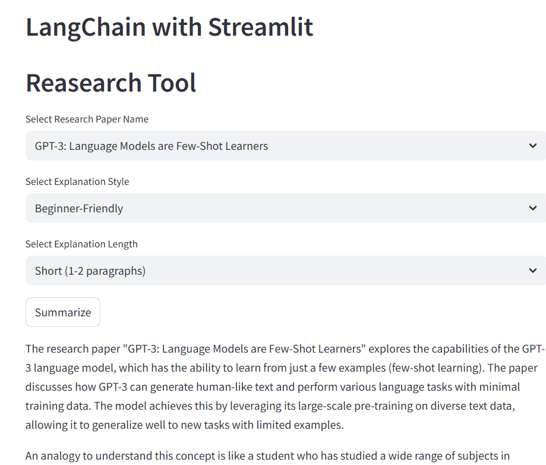

##  Research Paper Explainer using LangChain & Streamlit

This Streamlit application uses LangChain + OpenAI to generate well-structured explanations of famous AI research papers. Users can choose a paper, explanation style, and desired length — the app will generate a customized summary using LLMs.

##  Features

1. Choose from well-known AI research papers
2. Multiple explanation styles (Beginner, Technical, Mathematical, Code-focused)
3. Flexible output length (Short, Medium, Long)
4. Uses PromptTemplate via template.json
5. Built with Streamlit + LangChain + OpenAI API

## Tech Stack
Component	Technology
Frontend	Streamlit
LLM Orchestration	LangChain
Model Provider	OpenAI GPT
Configuration	.env + dotenv
##  Project Structure
├── .env                  # OpenAI API Key (not committed to Git)        
├── prompt_generator.py   # PromptTemplate configuration
├── prompt_ui.py          # Main Streamlit app
└── README.md             # Project documentation
└── template.json

##  Setup Instructions
# Clone Repository
git clone 
cd LANGCHAIN_PROMPTS

# Create .env File

Create a .env file in the root directory:

OPENAI_API_KEY=your_actual_openai_key

# Install Dependencies
pip install streamlit langchain-openai python-dotenv

# Run the App
streamlit run prompt_ui.py

# How It Works

User selects:

Research Paper Title

Explanation Style

Length

App loads template.json via load_prompt

LangChain pipes the prompt into ChatOpenAI

Response is displayed in Streamlit UI

## (Optional) Screenshot

Add UI screenshot here

## Contributions

Pull requests are welcome! Enhance prompt templates, add new research papers or features like exporting PDF, audio summary, etc.

## License

This project is licensed under the MIT License.